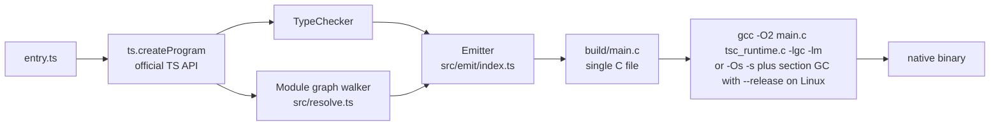
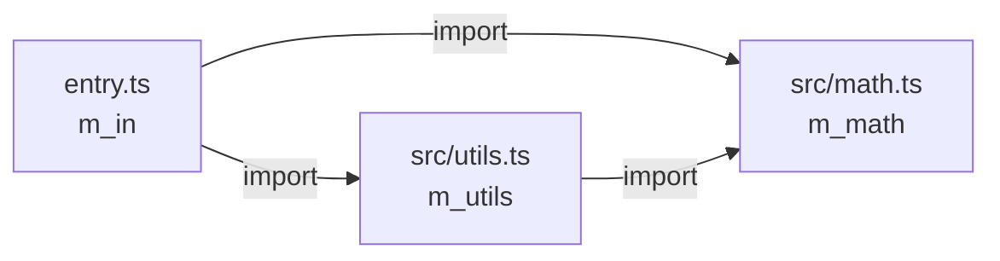
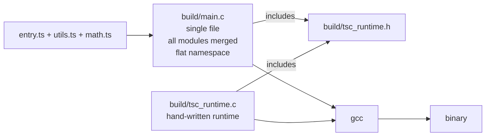
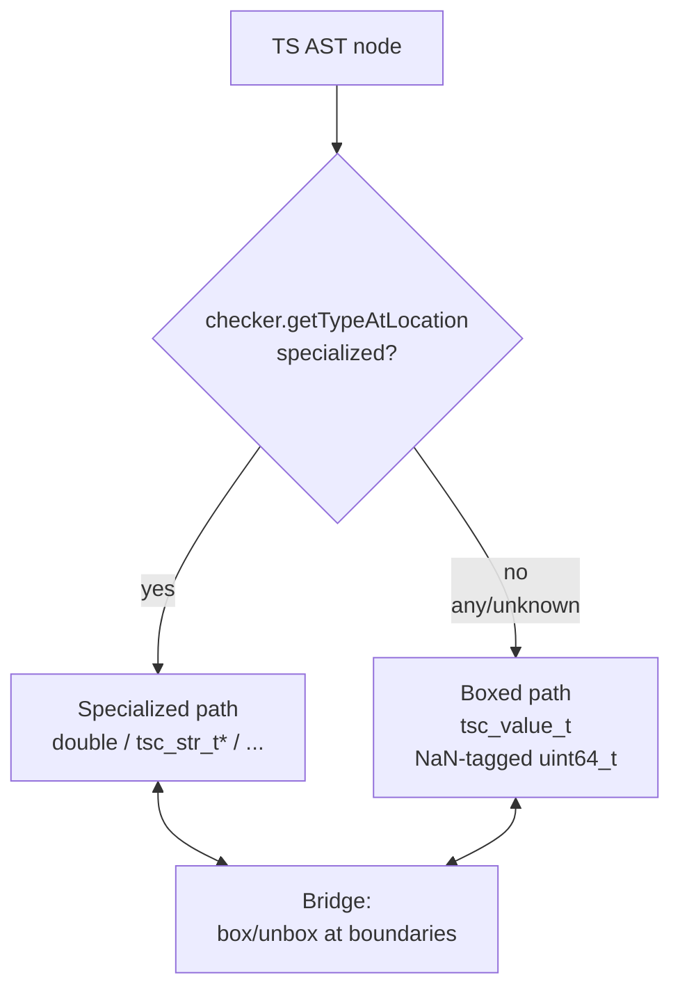
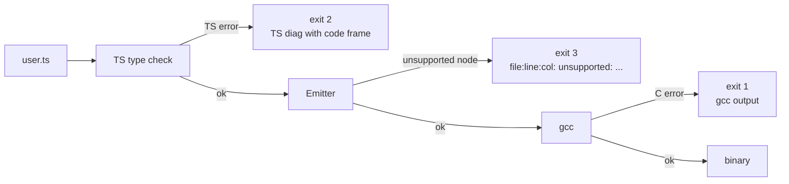

# Architecture

How `tsc2c` turns a TypeScript source tree into a native gcc-linked binary.

## Top-level pipeline



Every step maps to a file under `src/`:

| Stage | File | Responsibility |
|-------|------|---------------|
| Parse + type-check | `src/program.ts` | wraps `ts.createProgram` with our compiler options and `stdlib/lib.core.d.ts` as the ambient lib |
| Module graph | `src/resolve.ts` | walks `ts.Program.getSourceFiles()`, resolves imports via `ts.resolveModuleName`, topologically sorts |
| Emit | `src/emit/index.ts` | AST → C via the `Emitter` class |
| Link | `src/link/cc.ts` | spawns gcc with the right flags |
| Orchestrate | `src/compile.ts` | drives all of the above |
| CLI | `src/cli.ts` | commander-based argv parser |

## Emission: six passes per module

Inside `Emitter.emitModule()`, each source file goes through passes. The multi-pass structure lets cyclic declarations resolve (e.g. a class's method can reference another class declared later in the file, or even in a later module).

```mermaid
flowchart TD
    M[sf.statements] --> A[Pass A: struct fwd-decls<br/>typedef struct Foo_t Foo_t;]
    A --> B[Pass B: struct bodies<br/>struct Foo_t { ... };]
    B --> C[Pass C: function + method prototypes<br/>also lifted-arrow protos]
    C --> D[Pass D: function + method bodies<br/>also lifted-arrow bodies]
    D --> E[Pass E: top-level statements<br/>split into file-scope decls<br/>+ mod_init_mX assignments]
```

Pass A and B handle **both** class declarations and interface declarations — interfaces become C structs with fields, no methods. The emission is ordered A..E so every name is declared by the time it's used.

Pass E is the only place where module-scope `const`/`let` are special-cased: they're split into a file-scope declaration (`static T name;`) and an assignment inside `mod_init_mX()`. This promotion is what makes top-level names visible to functions + lifted arrows.

## Module graph + init ordering



Topo-sorted: `[m_math, m_utils, m_in]` (leaves first).

The final `main.c` calls mod_inits in that order, then returns:

```c
int main(int argc, char** argv) {
    tsc_bootstrap(argc, argv);
    mod_init_m_math();    // deps first
    mod_init_m_utils();
    mod_init_m_in();      // entry module last
    return 0;
}
```

Every runtime-reachable module's top-level statements execute inside its `mod_init`. Type-only import/export edges still let declarations from the referenced source file contribute C types and prototypes, but `main()` does not call that module's `mod_init`, so `import type` does not trigger runtime side effects. A narrow CommonJS package-source subset treats top-level `exports.name = ...`, `module.exports.name = ...`, chained `exports.name = module.exports.name = ...`, chained `module.exports.name = exports.name = ...`, `exports.name = void 0` / `module.exports.name = void 0` placeholder elision, `exports.default = ...`, `Object.defineProperty(exports, "default", { value })` default interop, `Object.defineProperty(exports, "name", { value })` / `Object.defineProperty(module.exports, "name", { value })` data exports, top-level `Object.defineProperties(exports, { name: descriptor })` descriptor-map exports, top-level `Object.assign(exports, { name: value })` / `Object.assign(module.exports, { name: value })` data/default export mutation, top-level `Object.assign(exports, require("./local.js"))` / `Object.assign(module.exports, require("./local.js"))` package-local re-export mutation, simple zero-arg `Object.defineProperty(..., { get() { return value; } })` getter exports, string-literal and statically computed `exports["name"] = ...` / `module.exports["name"] = ...`, object-literal identifier/function-valued/arrow-function-valued/method/primitive-literal exports, function-valued / arrow-function-valued / identifier-valued / primitive-literal / array-valued / static object-or-array-literal and supported runtime-computed dynamic-object `module.exports = ...` defaults via `Object.assign`/`Object.create`/`Object.defineProperty`/`Object.defineProperties`/`Object.fromEntries`/`Object.setPrototypeOf`/`Object.preventExtensions`/`Object.seal`/`Object.freeze`, including object-spread defaults over dynamic object values and object-literal named exports that spread package-local `require(...)` results, top-level literal `const pkg = require("pkg")` member reads/calls, top-level literal `require("pkg").name` member reads/calls, top-level literal `require("pkg")` reads for module-exported default values, top-level literal `require("pkg")(...)` calls for function-valued module exports, top-level literal `const { name, alias: local } = require("pkg")` bindings, top-level literal `const fn = require("pkg")` calls for function-valued module exports, package-local top-level literal `require("./local.js")` member/default/direct-default/member-default re-exports including `exports = module.exports = require("./local.js")` chains, top-level and package-local literal `module.require(...)` member reads/calls/re-exports, side-effect-only top-level `require("pkg")`, transpiled-ESM `Object.defineProperty(exports, "__esModule", ...)` and `exports.__esModule = true` marker elision, `__filename` / `__dirname` reads, and read-only `module.filename` / `module.id` / `module.path` / `module.loaded` / `module.paths` / `module.parent` / `module.children` / `module.isPreloading` metadata as exported module bindings/init edges instead of modeling the full CommonJS `exports` object and wrapper.

Static finite `require(...)` calls are collected throughout a source file, including function bodies and local `require` / `module.require` aliases, so function-scoped bindings can resolve to package-source exports. The specifier proof accepts literal strings plus top-level const string aliases, concatenation, template expressions whose parts are all statically known, conditional alternatives, identifiers annotated as finite string-literal unions or finite template-literal string types with string, numeric, bigint, boolean, null, or undefined literal placeholders, and top-level const string maps/arrays used through element/property access, including maps whose keys are statically computed. CommonJS package condition resolution recognizes `node-addons`, `node`, `require`, `module-sync`, and `default` branches in package order, including wildcard package `exports`, package-private `imports` target substitution, package-private `imports` external package targets, and array fallback targets. TypeScript package-source import resolution runs the bundler resolver with Node's `node-addons`, `node`, and `module-sync` conditions enabled, so ESM import edges can select package `exports` / package-private `imports` `node-addons`, `node`, or `module-sync` branches, wildcard targets, array fallbacks, and package-private `imports` external package targets. The module graph keeps import/export edges and CommonJS require edges in separate per-module specifier maps, so `import "pkg"` and `require("pkg")` from the same file can select different conditional package branches during AOT graph construction. Non-finite dynamic require sites may instead use `--dynamic-require-manifest <path>` with JSON shape `{ "requires": ["./specifier"] }`, a named object map such as `{ "requires": { "primary": "./specifier" } }`, or caller-scoped entries such as `{ "requires": { "src/loader.ts": ["./specifier"] } }`; caller-scoped keys resolve relative to the manifest file and only apply to exact normalized absolute source-file path matches, so unmatched dynamic callers remain rejected. Each listed specifier is compiled into the AOT module graph for the matching caller. Side-effect-only finite alternatives are all emitted as eager module edges; value-returning finite alternatives currently dispatch AOT-known `module.exports = ...` values or materialized named-export objects by comparing the evaluated specifier at runtime. Dependencies execute eagerly through `mod_init` by design; `tsc2c` does not attempt load-on-demand CommonJS execution for compiled binaries.

For the current package-source subset, untyped JavaScript object and array literals lower to `tsc_value_t` dynamic objects/arrays in local declarations, default-exported object literals, and named/default/namespace imports, which keeps common JS package initialization patterns compatible with dynamic `Object.assign(...)`, `Object.defineProperty(...)`, and `Object.fromEntries(...)` paths. JavaScript ESM packages can also import and call default function values from external CommonJS package dependencies, alongside the documented object-literal dependency path. JavaScript package re-export barrels also reuse TypeScript's alias metadata, so named re-exports, default-export aliases, and export-star bindings can resolve back to the source declarations already included in the AOT graph.

Cycles: the DFS in `src/resolve.ts` stops at the back edge, then continues — producing a best-effort topological order. Circular imports are compiled but not runtime-reordered; if module A's init reads from module B's uninitialized globals, the reader sees the zero value (since all file-scope statics are zero-initialized by the C ABI).

## Multi-file output model



Every user-defined module merges into one `main.c`. This keeps the flat symbol namespace viable at link time. A future session can switch to per-module `.c`/`.h` files once symbol prefixing is in, but flat-namespace was enough for the current 24-test suite.

## Value representation (typed path)

Today's emitter prefers specialized C types for each TS type and uses a NaN-boxed dynamic value only for `any` / `unknown` / heterogeneous unions. The `CType` model (in `src/emit/types.ts`) decides the C spelling based on TypeScript's inferred or annotated type:

| TS type | C type | Notes |
|---------|--------|-------|
| `number` | `double` | IEEE 754; int optimization deferred |
| `symbol` | `tsc_symbol_t*` | unique symbol identity plus global registry |
| `string` | `tsc_str_t*` | immutable UTF-8, GC'd |
| `boolean` | `bool` | `<stdbool.h>` |
| `any` / `unknown` | `tsc_value_t` | NaN-boxed dynamic value for numbers, strings, booleans, null/undefined, arrays, and dynamic objects |
| `void` / `null` / `undefined` | `void` / NULL sentinel | for pointer types |
| `T[]` / `Array<T>` | `tsc_array_t*` | dynamic array, element type known at emit |
| `Map<K, V>` | `tsc_map_t*` | type-erased runtime; key kind tag chooses compare fn |
| `Set<T>` | `tsc_set_t*` | same |
| `WeakMap<K, V>` | `tsc_map_t*` | pointer-key map without iteration API |
| `WeakSet<T>` | `tsc_set_t*` | pointer-key set without iteration API |
| `WeakRef<T>` | `tsc_weakref_t*` | typed target pointer wrapper |
| `RegExp` | `tsc_regexp_t*` | PCRE2 regex behind the wrapper |
| `(args) => ret` | `tsc_fn_*_t*` | typed closure value with generated `{fn, env}` struct; function-scope captures use GC-managed ref cells |
| `class Foo` | `Foo_t*` | struct with inherited fields laid at prefix |
| `interface Foo` | `Foo_t*` | same (struct of fields, no methods) |

When two CTypes disagree (e.g. assigning `null` to a `string` field), `Emitter.coerce()` inserts the bridge. Valid coercions today:

- `void` → any pointer kind = typed `NULL` cast
- any value → `string` = `tsc_str_from_num/bool/lit` helper
- same-kind classes with different names (up-cast) = C cast

Cross-type arithmetic / equality is rejected by the emitter with a `Cannot coerce` diagnostic.

## Dynamic value path

Phase 3 dynamic values use NaN-boxed `tsc_value_t` for `any` / `unknown` and heterogeneous unions, with descriptor-aware dynamic objects and arrays, shared Object/Array prototype values, hidden-class shape metadata, and focused inline caches on hot dynamic property sites. The plan in `~/.claude/plans/make-a-typescript-to-floating-comet.md` still covers broader performance and polish work; summary:



The current bridge boxes specialized primitives/arrays into `tsc_value_t` and supports dynamic JSON/object/array access, dynamic arithmetic/equality/relational/logical/nullish operators, shared Object/Array prototype method dispatch, descriptor-aware Object/Reflect helpers, per-site shape-validated caches for selected object property and Reflect get/set operations, and unboxing into typed destinations. Remaining roadmap work is tracked in [`todo.md`](todo.md#1-next-up-unblockers), starting with `async` / `await` lowering and libuv-backed async I/O.

## Runtime layer

`runtime/tsc_runtime.h` + `runtime/tsc_runtime.c` are the C runtime. Every produced binary includes these. Grouped by feature area:


Symbol-level reference: [`runtime-reference.md`](runtime-reference.md).

## Memory model

- Boehm GC (`libgc-dev`) by default. All user-visible allocations go through `TSC_GC_MALLOC` (tracked) or `TSC_GC_MALLOC_ATOMIC` (raw bytes, no scan).
- Fallback: `--no-gc` compile flag swaps the macros for `calloc`. The binary leaks everything but runs — useful in environments without libgc.
- Exception path: `setjmp`/`longjmp` with a single global error string (`g_current_error`). No stack traces yet.
- Classes and interfaces are pointer-backed; most values are heap-allocated, with narrow escape-analysis paths stack-allocating same-block non-escaping `new Class(...)` locals and typed object literal locals.
- Strings are immutable — every mutation returns a fresh allocation.

## Diagnostics flow



Three distinct exit codes let callers (tests, CI, other tools) tell categories of failure apart.

## Files-to-know list

For readers planning to modify the emitter:

- `src/emit/index.ts` — the whole `Emitter` class. One method per AST node kind.
- `src/emit/types.ts` — CType and `mapTsType` (the single source of truth for TS → C type mapping).
- `src/emit/cbuf.ts` — indent-tracked C source writer, raw preprocessor lines for `#line`, and string escape helpers.
- `src/emit/mangle.ts` — C keyword collision avoidance.
- `src/resolve.ts` — the module graph.
- `src/compile.ts` — the glue; typically read first for orientation.
- `runtime/tsc_runtime.h` — the authoritative list of runtime capabilities.
- `stdlib/lib.core.d.ts` — the authoritative list of what TS the checker will accept.
