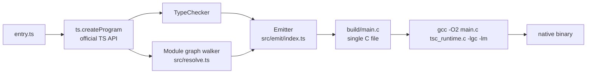
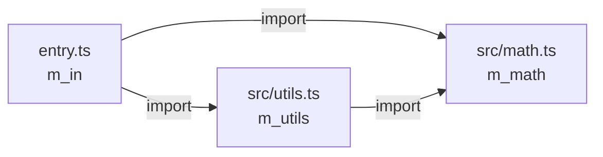
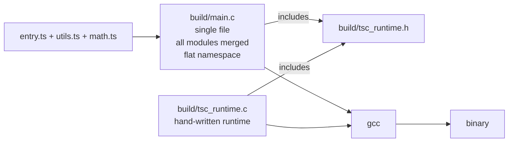
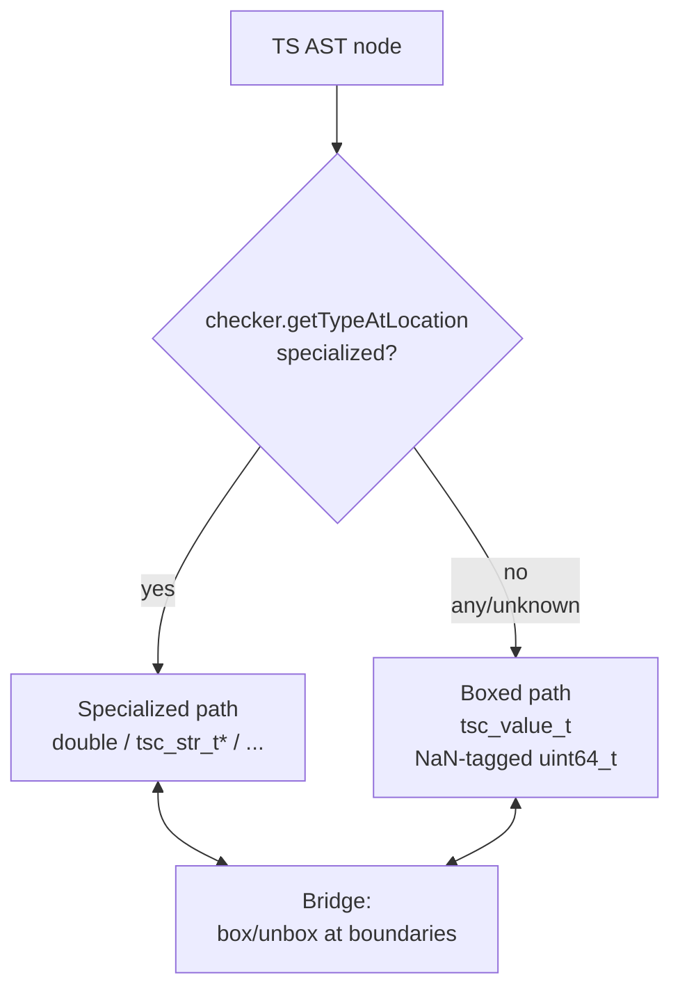
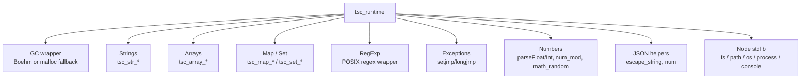
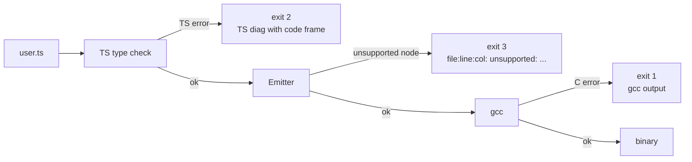

# Architecture

How `tsc2c` turns a TypeScript source tree into a native gcc-linked binary.

## Top-level pipeline



Every step maps to a file under `src/`:

| Stage | File | Responsibility |
|-------|------|---------------|
| Parse + type-check | `src/program.ts` | wraps `ts.createProgram` with our compiler options and `stdlib/lib.core.d.ts` as the ambient lib |
| Module graph | `src/resolve.ts` | walks `ts.Program.getSourceFiles()`, resolves imports via `ts.resolveModuleName`, topologically sorts |
| Emit | `src/emit/index.ts` | AST → C via the `Emitter` class |
| Link | `src/link/cc.ts` | spawns gcc with the right flags |
| Orchestrate | `src/compile.ts` | drives all of the above |
| CLI | `src/cli.ts` | commander-based argv parser |

## Emission: six passes per module

Inside `Emitter.emitModule()`, each source file goes through passes. The multi-pass structure lets cyclic declarations resolve (e.g. a class's method can reference another class declared later in the file, or even in a later module).

```mermaid
flowchart TD
    M[sf.statements] --> A[Pass A: struct fwd-decls<br/>typedef struct Foo_t Foo_t;]
    A --> B[Pass B: struct bodies<br/>struct Foo_t { ... };]
    B --> C[Pass C: function + method prototypes<br/>also lifted-arrow protos]
    C --> D[Pass D: function + method bodies<br/>also lifted-arrow bodies]
    D --> E[Pass E: top-level statements<br/>split into file-scope decls<br/>+ mod_init_mX assignments]
```

Pass A and B handle **both** class declarations and interface declarations — interfaces become C structs with fields, no methods. The emission is ordered A..E so every name is declared by the time it's used.

Pass E is the only place where module-scope `const`/`let` are special-cased: they're split into a file-scope declaration (`static T name;`) and an assignment inside `mod_init_mX()`. This promotion is what makes top-level names visible to functions + lifted arrows.

## Module graph + init ordering



Topo-sorted: `[m_math, m_utils, m_in]` (leaves first).

The final `main.c` calls mod_inits in that order, then returns:

```c
int main(int argc, char** argv) {
    tsc_bootstrap(argc, argv);
    mod_init_m_math();    // deps first
    mod_init_m_utils();
    mod_init_m_in();      // entry module last
    return 0;
}
```

Every module's top-level statements execute inside its `mod_init`. This matches CommonJS "module runs on first require" semantics.

Cycles: the DFS in `src/resolve.ts` stops at the back edge, then continues — producing a best-effort topological order. Circular imports are compiled but not runtime-reordered; if module A's init reads from module B's uninitialized globals, the reader sees the zero value (since all file-scope statics are zero-initialized by the C ABI).

## Multi-file output model



Every user-defined module merges into one `main.c`. This keeps the flat symbol namespace viable at link time. A future session can switch to per-module `.c`/`.h` files once symbol prefixing is in, but flat-namespace was enough for the current 24-test suite.

## Value representation (typed path)

Today's emitter produces specialized C types for each TS type — there's no boxing. The `CType` model (in `src/emit/types.ts`) decides the C spelling based on TypeScript's inferred or annotated type:

| TS type | C type | Notes |
|---------|--------|-------|
| `number` | `double` | IEEE 754; int optimization deferred |
| `string` | `tsc_str_t*` | immutable UTF-8, GC'd |
| `boolean` | `bool` | `<stdbool.h>` |
| `void` / `null` / `undefined` | `void` / NULL sentinel | for pointer types |
| `T[]` / `Array<T>` | `tsc_array_t*` | dynamic array, element type known at emit |
| `Map<K, V>` | `tsc_map_t*` | type-erased runtime; key kind tag chooses compare fn |
| `Set<T>` | `tsc_set_t*` | same |
| `RegExp` | `tsc_regexp_t*` | POSIX regex behind the wrapper |
| `class Foo` | `Foo_t*` | struct with inherited fields laid at prefix |
| `interface Foo` | `Foo_t*` | same (struct of fields, no methods) |

When two CTypes disagree (e.g. assigning `null` to a `string` field), `Emitter.coerce()` inserts the bridge. Valid coercions today:

- `void` → any pointer kind = typed `NULL` cast
- any value → `string` = `tsc_str_from_num/bool/lit` helper
- same-kind classes with different names (up-cast) = C cast

Cross-type arithmetic / equality is rejected by the emitter with a `Cannot coerce` diagnostic.

## Future: Phase 3 NaN-boxing (not yet built)

Phase 3 will add a second, dynamic path via NaN-boxed `tsc_value_t`. The plan in `~/.claude/plans/make-a-typescript-to-floating-comet.md` covers it; summary:



Today's code always takes the specialized path and refuses to emit for untyped/any code. Phase 3 introduces the boxed path + bridge. See [`todo.md`](todo.md#1-next-up-unblockers) for impact and effort.

## Runtime layer

`runtime/tsc_runtime.h` + `runtime/tsc_runtime.c` are the C runtime. Every produced binary includes these. Grouped by feature area:



Symbol-level reference: [`runtime-reference.md`](runtime-reference.md).

## Memory model

- Boehm GC (`libgc-dev`) by default. All user-visible allocations go through `TSC_GC_MALLOC` (tracked) or `TSC_GC_MALLOC_ATOMIC` (raw bytes, no scan).
- Fallback: `--no-gc` compile flag swaps the macros for `calloc`. The binary leaks everything but runs — useful in environments without libgc.
- Exception path: `setjmp`/`longjmp` with a single global error string (`g_current_error`). No stack traces yet.
- Classes and interfaces are heap-allocated; there's no value type for them.
- Strings are immutable — every mutation returns a fresh allocation.

## Diagnostics flow



Three distinct exit codes let callers (tests, CI, other tools) tell categories of failure apart.

## Files-to-know list

For readers planning to modify the emitter:

- `src/emit/index.ts` — the whole `Emitter` class. One method per AST node kind.
- `src/emit/types.ts` — CType and `mapTsType` (the single source of truth for TS → C type mapping).
- `src/emit/cbuf.ts` — indent-tracked C source writer + string escape helpers.
- `src/emit/mangle.ts` — C keyword collision avoidance.
- `src/resolve.ts` — the module graph.
- `src/compile.ts` — the glue; typically read first for orientation.
- `runtime/tsc_runtime.h` — the authoritative list of runtime capabilities.
- `stdlib/lib.core.d.ts` — the authoritative list of what TS the checker will accept.
